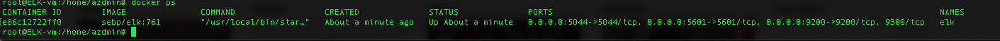

# ELK-Project
This is the ELK Project for Columbia Cybersecurity Bootcamp.  I used Azure to create a network with supporting VMs and installed a full functional ELK Server.

## Automated ELK Stack Deployment

The files in this repository were used to configure the network depicted below.

These files have been tested and used to generate a live ELK deployment on Azure. They can be used to either recreate the entire deployment pictured above. Alternatively, select portions of the _____ file may be used to install only certain pieces of it, such as Filebeat.

  - install-elk.yml

This document contains the following details:
- Description of the Topology
- Access Policies
- ELK Configuration
  - Beats in Use
  - Machines Being Monitored
- How to Use the Ansible Build

### Description of the Topology

The main purpose of this network is to expose a load-balanced and monitored instance of DVWA, the D*mn Vulnerable Web Application.

Load balancing ensures that the application will be highly availability, in addition to restricting traffic to the network.
- Load Balancing has the capability of deflecting DDOS attacks.  It redirects traffic and prevents unnecessary traffic from entering the network.  Having a jump box, will ensure that only one machine has admin access.  Thus you have to enter through one machine to access the rest of the network.  

Integrating an ELK server allows users to easily monitor the vulnerable VMs for changes to the logs and system traffic.
- Filebeat monitors log files and collects information on locations and then sends it to Elasticsearch.
- Metricbeat collects metrics and statistics and then sends the information to Elasticsearch.

The configuration details of each machine may be found below.

| Name                 | Function          | IP Address | Operating System |
|----------------------|-------------------|------------|------------------|
| Jump Box-Provisioner | Gateway           | 10.0.0.4   | Linux            |
| Web-1                | Web Server        | 10.0.0.7   | Linux            |
| Web-2                | Web Server backup | 10.0.0.8   | Linux            |
| ELK-vm               | ELK host          | 10.1.0.4   | Linux            |

### Access Policies

The machines on the internal network are not exposed to the public Internet.

Only the Jump machine can accept connections from the Internet. Access to this machine is only allowed from the following IP addresses:
- 67.85.7.51

Machines within the network can only be accessed by Jump Box-Provisioner.
- The Jump Box-Provisioner is the only machine that has access to the ELK-VM, it's IP is 10.0.0.4

A summary of the access policies in place can be found in the table below.

| Name     | Publicly Accessible | Allowed IP Addresses |
|----------|---------------------|----------------------|
| Jump Box | Yes                 | 67.85.7.51:22, 80    |
| Web-1    | No                  |                      |
| Web-2    | No                  |                      |
| ELK-vm   | Yes                 | 67.85.7.51:5601      |

### Elk Configuration

Ansible was used to automate configuration of the ELK machine. No configuration was performed manually, which is advantageous because...
- It frees up time for IT administrators to monitor the network and attend to other important IT tasks.  

The playbook implements the following tasks:
- Installs docker and python_TODO: In 3-5 bullets, explain the steps of the ELK installation play. E.g., install Docker; download image; etc._
- Installs python
- Increases memory to 262144
- Downloads and launches the docker elk container
- Enables docker on boot

The following screenshot displays the result of running `docker ps` after successfully configuring the ELK instance.

### Target Machines & Beats
This ELK server is configured to monitor the following machines:
- 10.0.0.7, 10.0.0.8

We have installed the following Beats, filebeat and metricbeat on these machines:
- 10.0.0.7, 10.0.0.8

These Beats allow us to collect the following information from each machine:
- Filebeat monitors and collects log files, specifically system.log and error.log.  It then outputs the results to Elasticsearch.  
  Metricbeat collects metrics and statistics and then sends them over to Elasticsearch.  From there you can digest information on the servers that you are
  monitorig.
  _TODO: In 1-2 sentences, explain what kind of data each beat collects, and provide 1 example of what you expect to see. E.g., `Winlogbeat` collects Windows logs, which we use to track user logon events, etc._

### Using the Playbook
In order to use the playbook, you will need to have an Ansible control node already configured. Assuming you have such a control node provisioned:

SSH into the control node and follow the steps below:
- Copy the _____ file to _____.
- Update the _____ file to include...
- Run the playbook, and navigate to http://52.165.225.40:5601/ to check that the installation worked as expected.

- The ELK playbook is called install-elk.yml and make sure it is installed in /etc/ansible/files.  To Filebeat playbook is called filebeat-playbook.yml and 
  should be located in /etc/ansible/roles.  Likewise for the Metricbeat playbook, it's called metricbeat-playbook.yml and should be located in /etc/ansible/roles.
- To update where the ELK playbook is run, please edit the hosts file located in /etc/ansible/.  You will change the IP address listed under [elk], this will be
  line 29.  
- To specify which machine to install Filebeat or Metricbeat, please edit the filebeat-config.yml or the metricbeat-config.yml located in /etc/ansible/files/. 
  This will be under Elasticsearch output.  
- Goto http://52.165.225.40:5601/ 

To run the playbook, make sure you are located in the directory where the playbook file is.  Once there, run:
ansible-playbook install-elk.yml

For filebeat and metricbeat:
ansible-playbook filebeat-playbook.yml
ansible-playbook metricbeat-playbook.yml

To update the playbook, from the directory:
nano install-elk.yml

For filebeat and metricbeat:
nano filebeat-playbook.yml
nano metricbeat-playbook.yml

To configure filebeat, goto /etc/ansible/files:
nano filebeat-config.yml and change lines 1105 and 1807.  Do not change lines 1106 and 1107.

To configure metricbeat, goto /etc/ansible/files:
nano metricbeat-config.yml and change lines 62 and 93.  Do not change lines 94 and 95.
