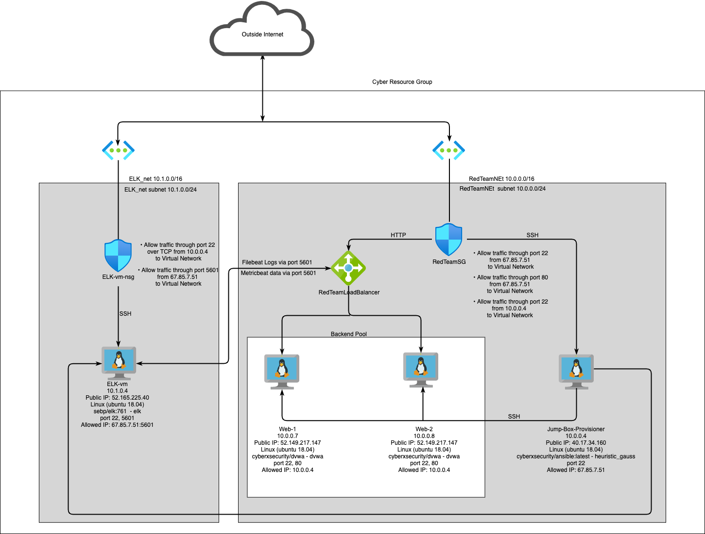

# ELK-Project
This is the ELK Project for Columbia Cybersecurity Bootcamp.  I used Azure to create a network with supporting VMs and installed a full
functional ELK Server.

## Automated ELK Stack Deployment

The files in this repository were used to configure the network depicted below.



These files have been tested and used to generate a live ELK deployment on Azure. They can be used to either recreate the entire
deployment pictured above. Alternatively, select portions of the playbook file may be used to install only certain pieces of it, such as
Filebeat.

  - **install-elk.yml**
  - **filebeat-playbook.yml**
  - **metricbeat-playbook.yml**

This document contains the following details:
- Description of the Topology
- Access Policies
- ELK Configuration
  - Beats in Use
  - Machines Being Monitored
- How to Use the Ansible Build


### Description of the Topology

The main purpose of this network is to expose a load-balanced and monitored instance of DVWA, the D*mn Vulnerable Web Application.

Load balancing ensures that the application will be highly available, in addition to restricting traffic to the network.
- Load Balancing has the capability of deflecting DDOS attacks.  It redirects traffic and prevents unnecessary traffic from entering the
  network.  Having a jump box, will ensure that only one machine has admin access.  Thus you have to enter through one machine to access
  the rest of the network.  


Integrating an ELK server allows users to easily monitor the vulnerable VMs for changes to the logs and system traffic.
- Filebeat monitors log files and collects information on locations and then sends it to Elasticsearch.  One example of this is it will
  monitor system.syslog and show any activity on the server.
- Metricbeat collects metrics and statistics and then sends the information to Elasticsearch.  An example of what metricbeat will detect
  is cpu and memory usage.

The configuration details of each machine may be found below.

| Name                 | Function          | IP Address | Operating System |
|----------------------|-------------------|------------|------------------|
| Jump Box-Provisioner | Gateway           | 10.0.0.4   | Linux            |
| Web-1                | Web Server        | 10.0.0.7   | Linux            |
| Web-2                | Web Server backup | 10.0.0.8   | Linux            |
| ELK-vm               | ELK host          | 10.1.0.4   | Linux            |

### Access Policies

The machines on the internal network are not exposed to the public Internet.

Only the Jump machine can accept connections from the Internet.
Access to this machine is only allowed from the following IP
addresses:
- 67.85.7.51

Machines within the network can only be accessed by Jump Box-
Provisioner.
- The Jump Box-Provisioner is the only machine that has access
  to the ELK-VM, it's IP is 10.0.0.4

A summary of the access policies in place can be found in the
table below.

| Name     | Publicly Accessible | Allowed IP Addresses  |
|----------|---------------------|-----------------------|
| Jump Box | Yes                 | Admins public IP: 22  |
| Web-1    | No                  |                       |
| Web-2    | No                  |                       |
| ELK-vm   | Yes                 | Admins public IP:5601 |

### Elk Configuration

Ansible was used to automate configuration of the ELK machine.
No configuration was performed manually, which is advantageous
because...
- It frees up time for IT administrators to monitor the network and attend to other important IT tasks.  It also allows one playbook to
  configure the entire system.

The playbook implements the following tasks:
- Installs docker.io and python3-pip
- Installs docker module
- Increases memory to 262144
- Downloads and launches the docker elk container
- Enables docker on boot

For the filebeat playbook, these tasks were implemented:
- download filebeat deb
- install filebeat deb
- drop in filebeat config
- enable and configure docker module for filebeat
- setup filebeat
- start filebeat service
- enable service filebeat on boot

For the metricbeat playbook, these tasks were implemented:
- download metricbeat
- install metricbeat
- drop in metricbeat config
- enable and configure docker module for metricbeat
- setup metricbeat
- start metricbeat service
- enable service metricbeat on boot

The following screenshot displays the result of running `docker
ps` after successfully configuring the ELK instance.


### Target Machines & Beats
This ELK server is configured to monitor the following machines:
- 10.0.0.7, 10.0.0.8

We have installed the following Beats, filebeat and metricbeat
on these machines:
- 10.0.0.7, 10.0.0.8

These Beats allow us to collect the following information from
each machine:
- Filebeat monitors and collects log files, specifically
  system.log and error.log.  It then outputs the results to
  Elasticsearch.  For example, Filebeat will show the output of logs and whether the
  system has been modified or not.
- Metricbeat collects metrics and statistics and then sends them over to Elasticsearch.  From there you can digest information on the
  servers that you are monitoring.  For example, it will show the uptime of a system.

### Using the Playbook
In order to use the playbook, you will need to have an Ansible control node already configured. Assuming you have such a control node
provisioned:

SSH into the control node and follow the steps below:
- Copy the **install-elk.yml**, **filebeat-config.yml**, and **metricbeat-config.yml** files to */etc/ansible/files/*.
- Update the config files to include the ```host: "10.1.0.4:5601"``` on line 62 and ```hosts: ["10.1.0.4:9200"]```.
- Update the hosts file in */etc/ansible/* to include the webservers: 10.0.0.7, 10.0.0.8 and elk: 10.1.0.4.
- Update the **ansible.cfg** in */etc/ansible/* to include on line 107: ```remote_user = azdmin```

- Run the playbook, and navigate to http://52.165.225.40:5601/ to check that the installation worked as expected.

- The ELK playbook is called **install-elk.yml** and make sure it is installed in */etc/ansible/files/*.  Both the filebeat and metricbeat
  playbook files are called **filebeat-playbook.yml** and **metricbeat-playbook.yml** and can be located in */etc/ansible/roles/*.
- To update where the ELK playbook is ran, please edit the hosts file located in */etc/ansible/*.  You will change the IP address listed
  under [elk], this will be line 29.  
- To specify which machine to install Filebeat or Metricbeat, please edit the **filebeat-config.yml** or the **metricbeat-config.yml**
  located
  in */etc/ansible/files/*.  This will be under Elasticsearch output.  
- Goto http://52.165.225.40:5601/

To run the playbook, make sure you are located in the directory where the playbook file is.  Once there, run:
```ansible-playbook install-elk.yml```

For filebeat and metricbeat:
```ansible-playbook filebeat-playbook.yml```
```ansible-playbook metricbeat-playbook.yml```

To update the playbook, from the directory:
```nano install-elk.yml```

For filebeat and metricbeat:
```nano filebeat-playbook.yml```
```nano metricbeat-playbook.yml```

To configure filebeat, goto */etc/ansible/files/*:
```nano filebeat-config.yml``` and change lines 1105 and 1807.  **Do not change lines 1106 and 1107.**

To configure metricbeat, goto */etc/ansible/files/*:
```nano metricbeat-config.yml``` and change lines 62 and 93.  **Do not change lines 94 and 95.**
